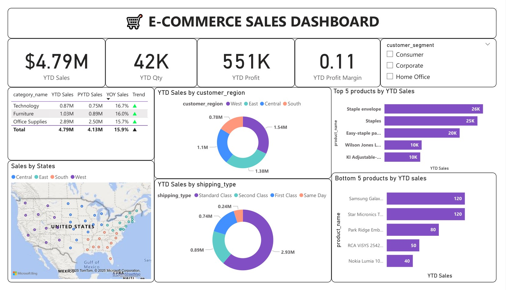

# 🛒 E-Commerce Sales Dashboard - Power BI Project


Interactive Power BI dashboard analyzing e-commerce sales data with geographic insights and business performance metrics.



## 🎯 What This Project Shows

This dashboard analyzes online store sales data to track:

- Total sales revenue and profit
- Product performance by category
- Regional sales distribution across USA
- Customer segment analysis
- Shipping method preferences


## 📊 Key Business Metrics

- **Total Sales**: \$4.79M YTD
- **Quantity Sold**: 42K items
- **Total Profit**: \$551K YTD
- **Profit Margin**: 0.11 (11%)
- **Product Categories**: Technology, Furniture, Office Supplies


## 🗺️ Dashboard Components

### 1. **Sales Performance Overview**

- Big number cards showing key metrics
- Year-to-date (YTD) tracking
- Profit margin calculations


### 2. **Category Analysis**

- **Technology**: \$0.87M sales
- **Furniture**: \$1.03M sales
- **Office Supplies**: \$2.89M sales (largest volume)
- Growth trends with green arrows showing positive performance


### 3. **Geographic Sales Map**

- Interactive US map with sales by state
- Visual representation of regional performance
- Customer location insights


### 4. **Regional Breakdown**

- **West Region**: \$1.54M (largest share)
- **East Region**: \$1.38M
- **Central Region**: \$1.1M
- **South Region**: \$0.78M


### 5. **Top \& Bottom Products**

- **Top 5 Products**: Led by Staple envelopes (\26K)
- **Bottom 5 Products**: Including Samsung Galaxy (\120)
- Product performance comparison


### 6. **Shipping Analysis**

- **Standard Class**: \$2.93M 
- **Second Class**: \$0.89M
- **First Class**: \$0.74M 
- **Same Day**: \$0.24M 


### 7. **Customer Segments**

- Consumer, Corporate, Home Office segments
- Interactive filtering options


## 🔍 Key Business Insights

### Revenue Performance

- Office Supplies category drives highest volume
- Technology has strong profit margins
- \$4.79M total revenue shows healthy business


### Geographic Trends

- West and East regions are top performers
- Sales distributed across entire USA
- Regional strategies can be optimized


### Product Strategy

- Staple products perform consistently well
- Electronics like Samsung need attention
- Mix of high-volume and high-value items


### Customer Behavior

- Multiple customer segments served
- Different shipping preferences by value
- Standard shipping most common choice


## 🛠️ Power BI Skills Used

- **Data Modeling**: Connected multiple CSV files
- **Relationships**: Linked sales data with location data
- **Geographic Visualizations**: Interactive US map
- **Card Visuals**: KPI dashboard cards
- **Bar Charts**: Category and product analysis
- **Donut Charts**: Regional and shipping breakdowns
- **Filters**: Customer segment filtering
- **DAX Calculations**: Profit margins, YTD calculations
- **Color Coding**: Consistent theme and branding


## 📁 Project Files

```
📦 ecommerce-sales-powerbi/
├── 📄 README.md                        (This file)
├── 📊 dashboard.pbix                    (Power BI file)
├── 📄 dashboard_export.pdf              (PDF version)
├── 📋 ecommerce_sales_data.csv          (Main sales data)
├── 🌍 latitude_longitude.csv            (Location data)
└── 📸 dashboard_screenshot.jpg          (Dashboard image)
```


## 📱 How to View

### Option 1: Interactive Dashboard

1. Download `dashboard.pbix`
2. Open with Power BI Desktop
3. Use filters to explore data

### Option 2: Static View

1. Open `dashboard_export.pdf`
2. View all charts and metrics
3. See complete analysis results

### Option 3: Quick Preview

- Check `dashboard_screenshot.jpg` for overview


## 💡 Business Value

### For Sales Teams

- Track performance by region and product
- Identify top and bottom performers
- Monitor shipping method preferences


### For Management

- Overall business health monitoring
- Profit margin analysis
- Strategic planning insights


### For Marketing

- Customer segment analysis
- Regional focus areas
- Product promotion opportunities


## 🎓 Skills Demonstrated

- ✅ Power BI Dashboard Development
- ✅ Geographic Data Visualization
- ✅ Sales Performance Analysis
- ✅ Multi-table Data Modeling
- ✅ Business KPI Tracking
- ✅ Interactive Report Design


## 🔮 Future Enhancements

- Time-series trend analysis
- Customer lifetime value
- Seasonal sales patterns
- Inventory management insights
- Predictive sales forecasting

***

**Created by**: [sankaran-s2001](https://github.com/sankaran-s2001)
**Tools Used**: Power BI, CSV data processing
**Project Type**: Business Intelligence Dashboard

## ✉️ Contact

**Sankaran S**  
[](https://github.com/sankaran-s2001) [](https://www.linkedin.com/in/sankaran-s21/) [](mailto:sankaran121101@gmail.com)

